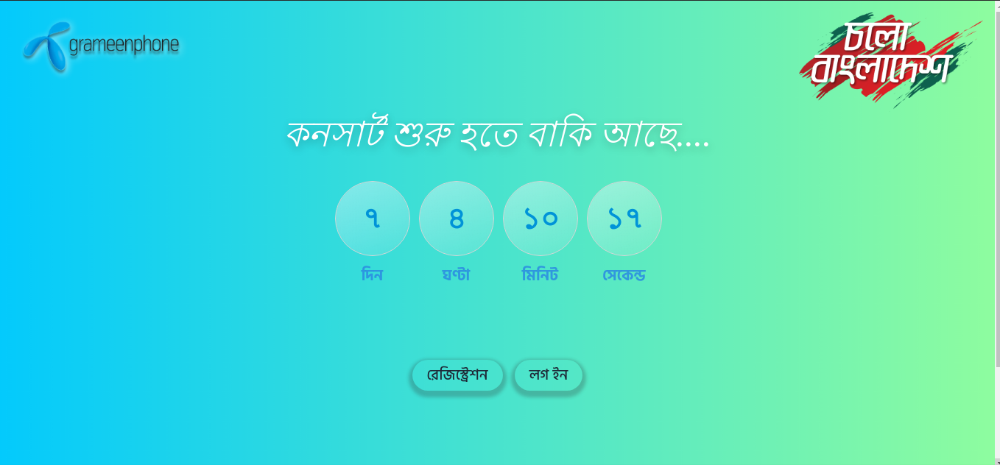
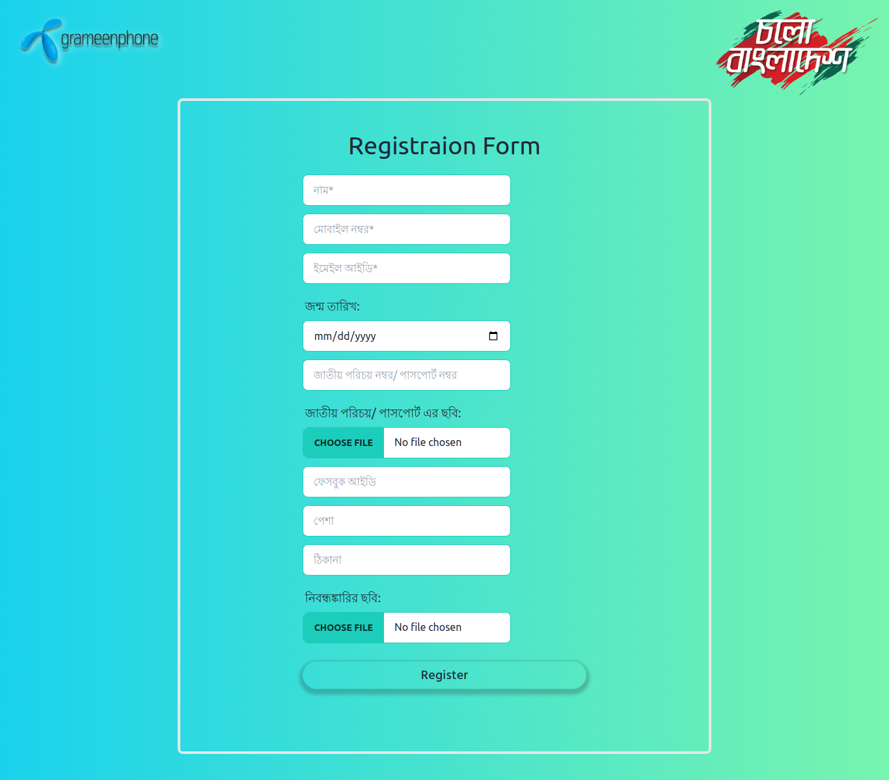
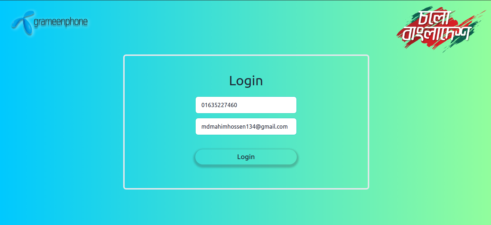
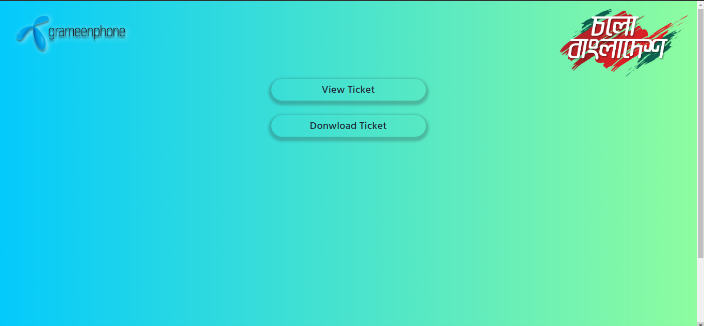

## About Ticketing System

<p>This is a Ticketing system for concert like event</p>

### key Feature
- Here a user can registration using their information 
- after registration you can download your ticket.
- the ticket will send to given email address automatically 
- user will get phone sms for download the ticket
- user can sign in anytime to download the ticket if they forgot to download before

- <b>admin panel </b>
- admin can see all registration data
- admin can download all registration data in csv in one click
- admin can minitor website traffic from admin panel
- admin can turn off/on the ticketing site


### Demo Image 

- 
- 
- 
- 


### To Run the project follow this step
```bash
 git clone <my-cool-project>
 composer install
 cp .env.example .env
 php artisan key:generate
 php artisan migrate
 php artisan serve

```